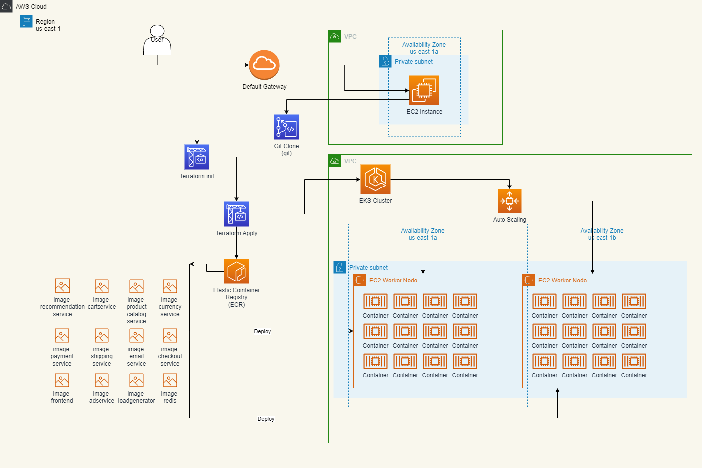

# Obligatorio Implementación de Soluciones Cloud 2023
---
## Integrantes
- Alexander Delamar (272946)
- Matías Landoni (261816)

## Objetivo del Obligatorio
Configurar y desplegar la infraestructura necesaria para la implementacion de los servicios proporcionados.

## Solucion
Se despliega la siguiente infraestructura mediante terraform:

* EKS (Cluster, Worker Group, Contenedores)
* ECR (Repositorio, Imagenes)
* VPC (Subnets, Gateway, RT)

| ----------------------------------------------------------------------------------------------------------------- | 
|  |

---

> **⚠ ATTENTION: Apache Log4j 2 advisory.**  
> Due to [vulnerabilities](https://cloud.google.com/log4j2-security-advisory) present in earlier versions
> of Log4j 2, we have taken down all affected container images. We highly recommend all demos and forks to now
> use images from releases [>= v0.3.4](https://github.com/GoogleCloudPlatform/microservices-demo/releases).

**Online Boutique** is a cloud-native microservices demo application.
Online Boutique consists of a 10-tier microservices application. The application is a
web-based e-commerce app where users can browse items,
add them to the cart, and purchase them.

## Screenshots

| Home Page                                                                                                         | Checkout Screen                                                                                                    |
| ----------------------------------------------------------------------------------------------------------------- | ------------------------------------------------------------------------------------------------------------------ |
|  |  |

## Architecture

**Online Boutique** is composed of 11 microservices written in different
languages that talk to each other over gRPC. See the [Development Principles](/docs/development-principles.md) doc for more information.

Find **Protocol Buffers Descriptions** at the [`./pb` directory](./pb).

| Service                                              | Language      | Description                                                                                                                       |
| ---------------------------------------------------- | ------------- | --------------------------------------------------------------------------------------------------------------------------------- |
| [frontend](./src/frontend)                           | Go            | Exposes an HTTP server to serve the website. Does not require signup/login and generates session IDs for all users automatically. |
| [cartservice](./src/cartservice)                     | C#            | Stores the items in the user's shopping cart in Redis and retrieves it.                                                           |
| [productcatalogservice](./src/productcatalogservice) | Go            | Provides the list of products from a JSON file and ability to search products and get individual products.                        |
| [currencyservice](./src/currencyservice)             | Node.js       | Converts one money amount to another currency. Uses real values fetched from European Central Bank. It's the highest QPS service. |
| [paymentservice](./src/paymentservice)               | Node.js       | Charges the given credit card info (mock) with the given amount and returns a transaction ID.                                     |
| [shippingservice](./src/shippingservice)             | Go            | Gives shipping cost estimates based on the shopping cart. Ships items to the given address (mock)                                 |
| [emailservice](./src/emailservice)                   | Python        | Sends users an order confirmation email (mock).                                                                                   |
| [checkoutservice](./src/checkoutservice)             | Go            | Retrieves user cart, prepares order and orchestrates the payment, shipping and the email notification.                            |
| [recommendationservice](./src/recommendationservice) | Python        | Recommends other products based on what's given in the cart.                                                                      |
| [adservice](./src/adservice)                         | Java          | Provides text ads based on given context words.                                                                                   |
| [loadgenerator](./src/loadgenerator)                 | Python/Locust | Continuously sends requests imitating realistic user shopping flows to the frontend.                                              |

---

## Requisitos host local

 - Kubernetes
  
 - Docker
  
 - Terraform
  
 - AWS CLI configurado con credenciales de usuario
  
## Pasos de implementación
 
 1. Clonar repositorio https://github.com/AlexanderDelamar/ObligatorioCloud.git

 2. Provisionar al archivo build-docker-images.sh con el account ID

 3. Ejecutar el siguiente comando para el despliegue

  * terraform apply -var-file=valores.tfvars

 4. Una vez finalizado el despliegue, ejecutar el siguiente comando para obtener la direccion a la pagina

  * kubectl get svc
   
